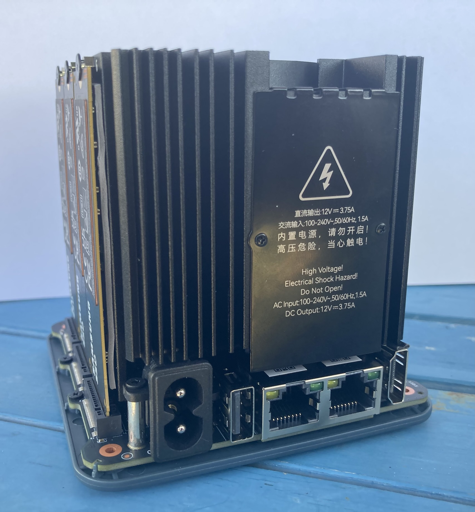
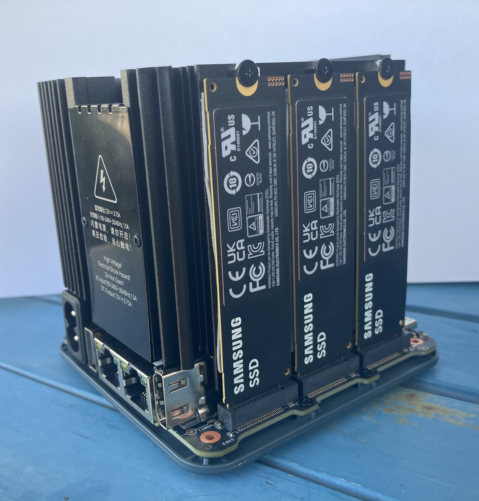
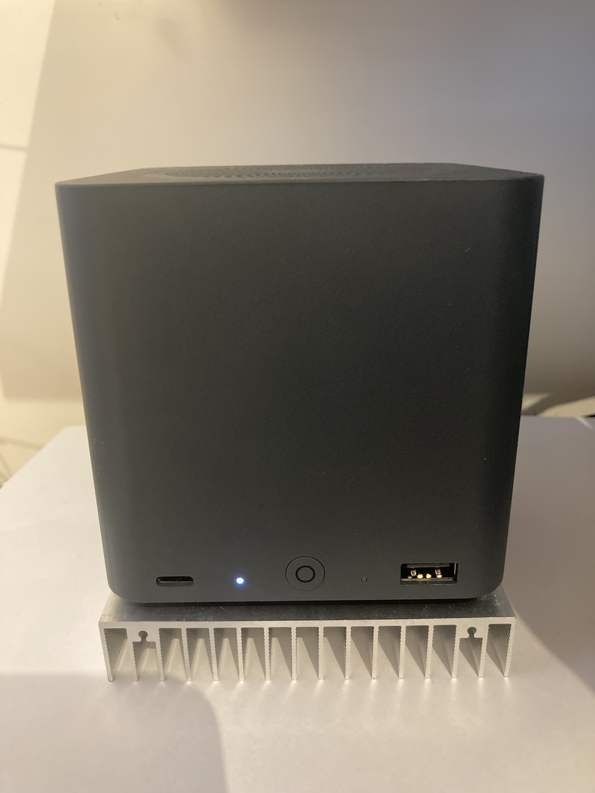

# Info and Setup for the Beelink ME Mini

   * [General](#general)
   * [Common and Solvable Issues](#common-and-solvable-issues)
   * [Recommended NVME's](#recommended-nvmes)
   * [Thermal Improvements](#thermal-improvements)
      * [Replacing the NVME Thermal Pads:](#replacing-the-nvme-thermal-pads)
      * [Improve Heat Dissipation](#improve-heat-dissipation)
   * [BIOS](#bios)
      * [Update the BIOS](#update-the-bios)
      * [Change BIOS Settings](#change-bios-settings)

## General

The [Beelink ME Mini](https://www.bee-link.com/products/beelink-me-mini-n150) is imho a perfect hardware for running [TrueNas](https://www.truenas.com/) in home and small office environments.

There are some caveats from other posters you will find on the interent, but from my perspective it is a good choice **when you prepare properly** especially the BIOS.

Note that I have added Amazon links to the additional products I used besides the Beelink Me Mini.

## Common and Solvable Issues

* Purchase the correct NVMe SSDs.
* Improve the thermal properties. It's not mandatory, but it's better to be safe than sorry.
* The BIOS that ships with the device usually needs to be upgraded, especially when running M1V304.
* Some BIOS settings must be changed.

## Recommended NVME's

I use six [Samsung 990 PRO 2TB NVMe SSDs](https://www.amazon.de/dp/B0B9C4DKKG?ref=fed_asin_title), which are very stable and reliable in the Beelink Me Mini. Although these PRO NVMe SSDs are more expensive, they provide a long-lasting, worry-free experience. Based on my experience with many other setups over the years, I can rely on the PRO versions, especially for storage. They are also very power efficient, which takes advantage of the maximum power available on the Mini. As you can see in the stress test I conducted, which includes performance, temperature, and power draw values, temperature and power draw are not issues at all.

## Thermal Improvements

I was worried that the Samsung 990 PRO would push my system into high thermal regions, so I upgraded the thermal environment.

**Note that this turned out not to be mandatory**, but it lowered the temperature to ~42° for the CPU and ~45° for the NVMe drives in normal operation mode, which is quite nice. The location at which you place the Beelink ME Mini may affect the temperature.

The changes made are the following:

* Replace the NVME thermal pads in the Beelink ME Mini.
* Improve the Beelink ME Mini's heat dissipation.

### Replacing the NVME Thermal Pads:

This is a ZEN job and should not be done by people having limited patience and shaky fingers :sweat_smile:

First I purchased [Aairhut Pack of 4 13W/m.K Thermal Pads](https://www.amazon.de/Aairhut-W%C3%A4rmeleitpads-Hitzebest%C3%A4ndigkeit-Abdeckung-selbstklebenden/dp/B0BQJGY7H4/ref=sr_1_2?sr=8-2). They come in different thicknesses, and they can be cut to different sizes - with a scissor.

**Note** that you need to handle them with absolute care. Once the protection foil is off, it wont stick again on, though you have good contact when in use.

It turned out that the 0.5 mm version was too thin, resulting in poor contact with the SSDs. The 1.0 mm version, on the other hand, was slightly too thick, causing the drives to bend excessively.

The solution was to use a perfectly clean rolling pin to squeeze the 1.0 mm strips, which had already been cut to size, down to about 0.7 mm. This thickness matched the requirements without bending the drives. Since the excess material had to go somewhere, it was necessary to cut it off on all sides. 

Once this is complete, you can remove the original pads, replace them with the customized ones, and add the drives. After gently pressing the drives onto the pads, secure them with the screw.

 

Note that when you need to remove a drive, use a thin tool, such as a cutter or toothpick, to safely separate the drive from the pad, which should ideally remain stuck to the heatsink.

When this is done, close the cover of the Beelink ME Mini.

### Improve Heat Dissipation

The main goal was to use a heat sink with the same dimensions as the Beelink ME Mini, on which it will be placed.

To accomplish this, I ordered an [Alu Heatsink 100x100x18](https://www.amazon.de/dp/B07M9RVNP5?ref=fed_asin_title) and standard [Heat Pads](https://www.amazon.de/dp/B0CF96FKJV?ref=fed_asin_title) which also come in different sizes. Since all parts have the same dimensions, it's a perfect match.

First, use the 0.5 mm pad to cut out a 58-59 mm circle with a sharp cutter which is slightly smaller than the 60 mm circle measured. It is easiest if you first trace the circle with a pen on the pad. Then, using a cutting board, cut through a starting point and move the pad, not the cutter. Place the pad in the middle of the bottom of the Beelink ME Mini. Then, use the 1.0 mm pad to cut out a 74 mm circle. Apply it on top, covering the thin pad and the rubber pads. This should provide good contact with the heatsink when you place the Beelink ME Mini on it, while leaving the exhaust holes free.



## BIOS

### Update the BIOS

The Beelink ME Mini typically ships with an outdated BIOS that must be upgraded before use.

**I consider this a mandatory task for worry-free operation.**

Download the BIOS from the source which can be found at [dr.bee-link.cn](https://dr.bee-link.cn/?dir=uploads%2FMEmini).
At the time of writing, this was `M1V307`. You will also find instructions on how to install it. To easy access, I have provided a direct download link to the BIOS from this repository: [M1V307_12G.zip](./M1V307_12G.zip).

In short, prepare a USB drive with at least 16 GB of capacity and format it to FAT32. Name the volume "WINPE" and copy the extracted files from the ZIP file to the drive. Then, boot the Beelink ME Mini from the USB inserted and the upgrade will start.

USB preparation in Linux looks like this in the terminal, assuming you already have unzipped the BIOS file:

Insert the USB stick and run the following commands in order, **replace the devicename accordingly such as `sdc` as reported by `lsblk`**. Important, the USB stick must not be mounted when starting the process.

```
lsblk
sudo mkfs.vfat -F 32 -n 'WINPE' /dev/sdc1
sudo mkdir -p /mount/usb 
sudo mount /dev/sdc1 /media/usb
sudo cp -rp <source of extracted BIOS> /media/usb
sudo sync
sudo umount /dev/sdc1
```

Check the BIOS settings, see next section!

### Change BIOS Settings

In my experience, changes made in the BIOS may not be upgrade persistent, except for the boot order settings. For safety purposes, check these settings if you have changed them after upgrading the BIOS.

* For automatic power-on after power loss:
  ```
  Chipset > 
  PCH-IO Configuration > 
  State After G3 - change to [S0 state] (was S5 state)
  ```

* Set boot process:
  ```
  Boot >
  Quiet boot - disabled (was enabled)
  Fast boot  - disabled (was enabled)
  ```

* Disable SATA because it is not present in the Beelink ME Mini.
  ```
  Chipset >
  PCH-IO Configuration >
  SATA Configuration >
  SATA Controllers - disabled (was enabled)
  ```

* HS400 software tuning (eMMC):\
Optimize the eMMC interface in HS400 mode for maximum data transfer speeds and reliability
  ```
  PCH-IO Configuration >
  SCS Configuration >
  Enable HS400 software tuning - enabled (was disabled)
  ```

* Increase recognition time for PCIe devices such as NVME:\
**This fixes the issue of NVMe drives not being partially recognized after rebooting or a power loss.** No need to fiddle with kernel power options for PCIe / NVME in TrueNAS! This is important because if you don't set it, you may need to reboot manually a couple of times, hoping that all NVMe drives are detected properly. While running TrueNAS, you can verify that all drives have been properly identified by typing `sudo nvme list`.
  ```
  PCH-IO Configuration >
  PCI Express root port (do on all roots) >
  Detect timeout - 2000 (was 0)
  ```
  ```
  System Agent (SA) configuration >
  PCI Express configuration >
  PCI Express root port (do on all roots) >
  Detect timeout - 2000 (was 0)
  ```
